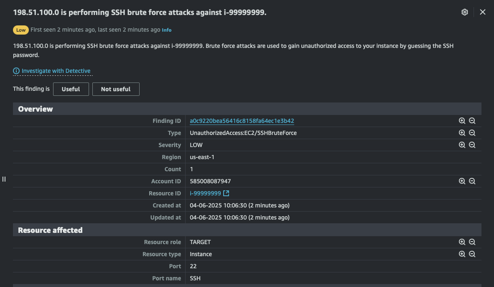
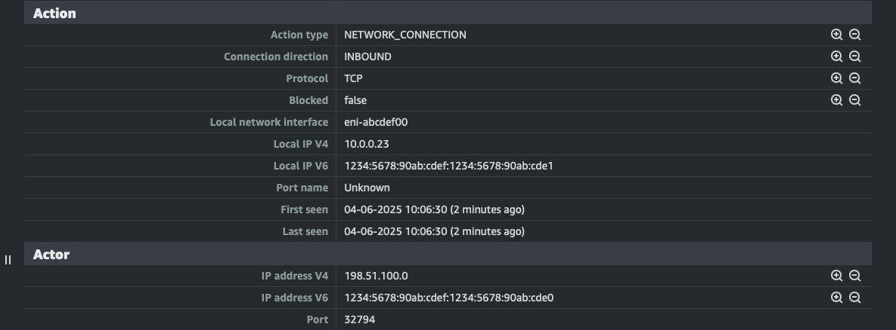
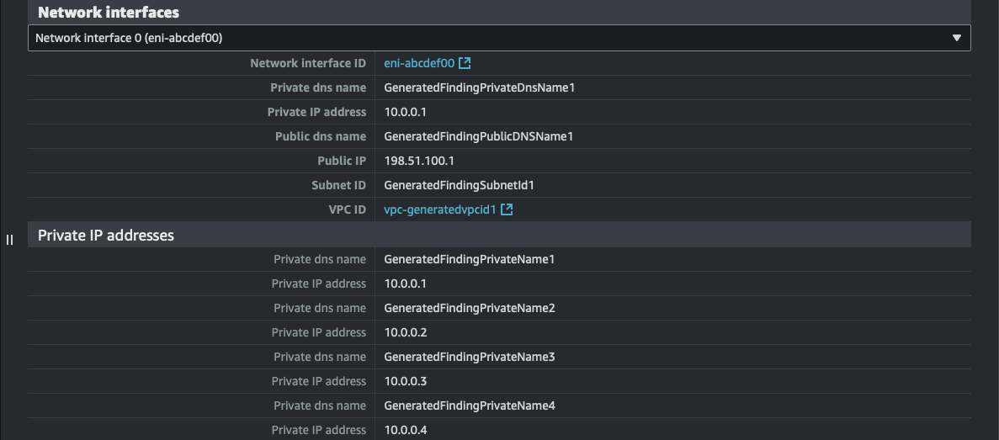

# 🧪 Simulated Threat Activity: SSH Brute Force

## ✅ Triggered on: April 6, 2025

### 🎯 What Was Simulated:
- **Type:** UnauthorizedAccess:EC2/SSHBruteForce
- **How:** Used AWS CLI and GuardDuty’s `create-sample-findings` API to simulate an SSH brute-force attack
- **Region:** us-east-1
- **Severity:** LOW (expected for sample finding)

### 💡 Why This Matters:
This simulated finding proves that GuardDuty is actively monitoring and can detect unauthorized access attempts on EC2 instances. It's an essential part of validating that threat detection is functioning.

### 🧪 CLI Command Used:
```bash
aws guardduty create-sample-findings \
  --detector-id $(aws guardduty list-detectors --query 'DetectorIds[0]' --output text) \
  --finding-types UnauthorizedAccess:EC2/SSHBruteForce \
  --region us-east-1
```
---

## 🖼️ Screenshots: Simulation & Findings

  
*Command used to simulate SSH brute-force attack via AWS CLI*

  
*GuardDuty showing the generated SSH brute-force finding*

  
*Actor IP, direction, and connection protocol*

  
*Simulated target EC2 instance metadata*

  
*Private IPs, security groups, and VPC info*

---

## 🧠 What This Proves

This simulation confirmed that GuardDuty is properly configured to detect brute-force attempts on EC2 instances. It triggered a finding using a known AWS CLI command, allowing us to test detection **without deploying any real threat**.

This is an essential step before building automation with EventBridge and Lambda.

---
